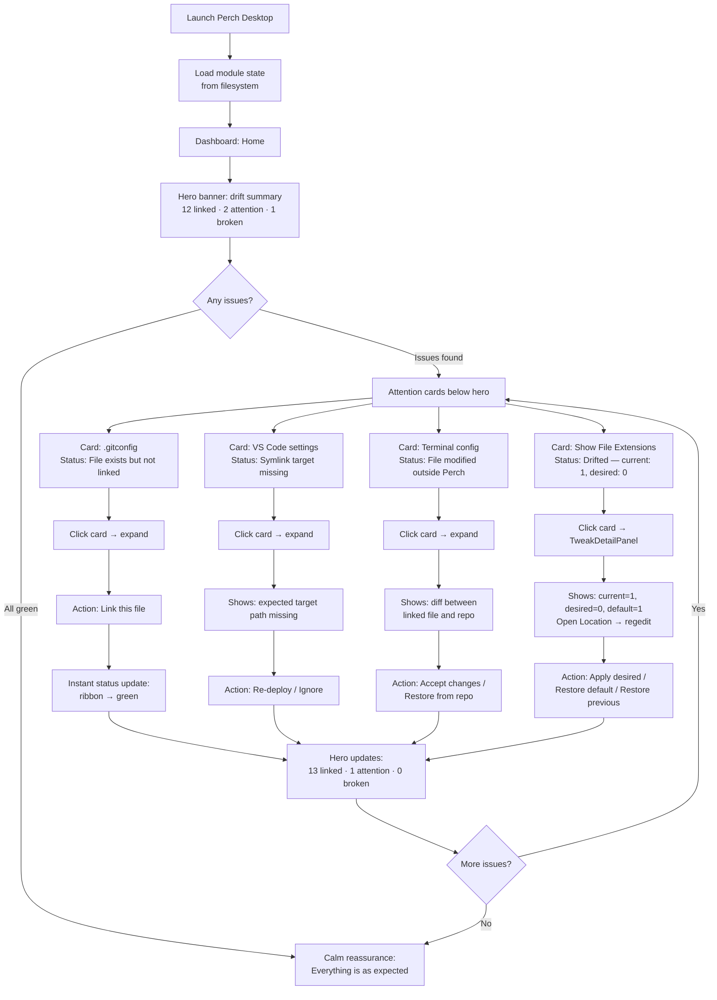
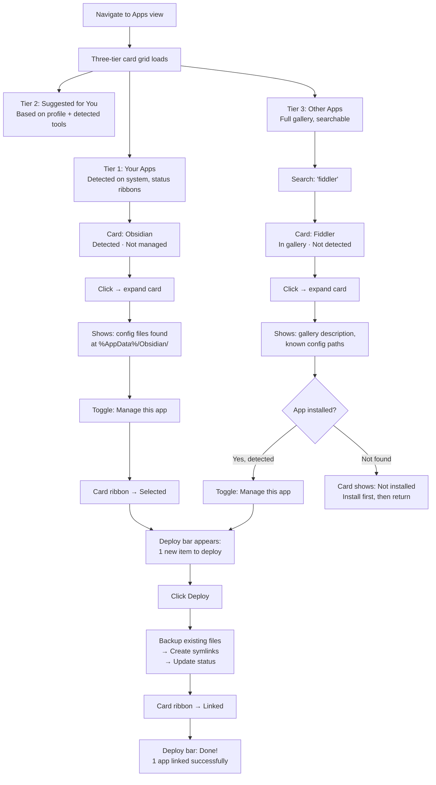

# UX Design Specification Perch

**Author:** Wouter
**Date:** 2026-02-16

---

<!-- UX design content will be appended sequentially through collaborative workflow steps -->

## Executive Summary

### Project Vision

Perch Desktop is a WPF desktop application for managing dotfiles and application settings on Windows. It replaces the previous Avalonia prototype with a polished, visually appealing experience built on a modern WPF component library (WPF UI, HandyControl, or similar). The app serves two modes: a streamlined onboarding wizard for first-run setup, and a drift-focused dashboard for ongoing config health monitoring — both sharing the same reusable view components backed by the Perch.Core engine.

### Target Users

- **Developers:** Primary audience. Interested in dotfiles (.gitconfig, .vimrc), editor settings, shell configs. Shown the full experience including dotfiles management.
- **Power Users:** System tweakers managing app settings, Windows registry, terminal configs. Similar to developers but less focused on dotfiles.
- **Gamers / Casual Users:** Simplified experience. Dotfiles step hidden. Focus on app settings and system tweaks.

Profile selection at onboarding (with Midjourney-generated hero image cards) drives which views and content are shown throughout the app.

### Key Design Decisions

- **WPF over Avalonia:** Richer component library ecosystem, better designer tooling, modern Fluent Design libraries available. Windows-only is acceptable — the CLI handles cross-platform.
- **Component library:** Evaluating WPF UI (lepoco/wpfui), UI.WPF.Modern (iNKORE-NET), and HandyControl. Need sidebar NavigationView, card controls, step indicators, badges.
- **Drift-focused dashboard:** The daily-driver view. Shows config health at a glance — what's linked, what's broken, what needs attention. Not a settings panel; a verification tool.
- **Reusable views:** Dotfiles, Applications, and System Tweaks are UserControls used in both wizard (step-by-step with stepper) and dashboard (standalone via sidebar navigation) contexts.
- **Unified tree taxonomy:** Everything Perch manages — apps, dotfiles, tweaks, fonts — lives in one navigable, drillable tree with deep category paths (e.g., `Apps/Languages/.NET/Editors/Visual Studio`). The WPF tree browser is the primary gallery discovery UX. The Astro website is marketing only.
- **Smart detection:** App and dotfile cards are populated by scanning the system (detect-first flow). Detected items shown prominently with status ribbons. Gallery items shown as suggestions below. Full gallery searchable. On new machines, Perch scans existing state first and shows what's already in place before configuring.
- **Mechanism-aware smart status:** Status is type-specific — registry tweaks show Applied/Drifted/Not Applied/Reverted/Error; apps show Installed/Not Installed/Update Available; dotfiles show Linked/Broken/Not Linked/Modified; fonts show Installed/Not Installed. Cross-cutting: Skipped (excluded for machine), hidden (wrong OS).
- **App-owned tweaks:** Apps own their bad behavior in the tree. Visual Studio's telemetry keys, context menu additions, and startup entries are toggleable sub-items under the VS node, not separate tweak entries.
- **Visual polish:** Midjourney-generated hero images for profile cards. Real app icons/logos for app cards. Perch logo (bird silhouette concept) in sidebar. Dark theme.
- **Startup loading:** Module/drift state loaded once at startup, no real-time file watching needed.

### Key Design Challenges

- Bridging a power-user domain (symlinks, dotfiles, platform paths) with an approachable visual interface
- Card information density: status ribbon, app icon, name, description, and action menu must be scannable without clutter
- Wizard-to-dashboard transition: same components must feel natural in both guided (wizard) and standalone (dashboard) contexts
- Gallery dependency: detection-first design must degrade gracefully when the app gallery is unavailable or incomplete
- Unified tree depth: deep category paths (`Apps/Languages/.NET/Editors/Visual Studio`) must feel navigable, not overwhelming. Tree depth should match content density — no subcategories for 2 items
- Multi-mechanism tweak cards: registry tweaks, PowerShell tweaks, and fonts need consistent card UX despite different underlying mechanisms. Inline value display (current/desired/default) must be clear without clutter
- App-owned tweaks: app cards that also contain toggleable tweak sub-items need clear visual hierarchy — the app is the parent, its tweaks are nested actions

### Design Opportunities

- Profile-driven filtering eliminates irrelevant options and reduces cognitive load
- Drift dashboard as a "config health control center" — unique value no CLI can replicate. Three-value model (current/desired/default) makes drift tangible and actionable
- Detection-first card layout ("here's what you have") feels intelligent rather than asking users to configure from scratch
- Card-based UI is inherently visual and can showcase the Midjourney/icon artwork
- Unified tree as a "single pane of glass" for everything Perch manages — apps, dotfiles, tweaks, fonts in one browsable hierarchy
- "Open Location" deep links from tweak cards (regedit, Explorer, services.msc) bridge the gap between visual management and system-level control
- App-owned tweaks make the connection between "I installed this app" and "it did these things to my system" visible and manageable

## Core User Experience

### Defining Experience

Perch Desktop serves two distinct but equally important experiences:

**The Wizard (first run, potentially the only run):** A guided onboarding flow where users select their profile(s), see their system reflected back as smart-detected cards, toggle what they want managed, and deploy. For many users, this is the complete Perch Desktop experience — run once, configs linked, done. It must feel polished and complete as a standalone experience, not merely a stepping stone to the dashboard.

**The Dashboard (ongoing, for users who return):** A drift-focused config health overview. Open Perch, see what's correct, what's changed, what needs attention. Quick actions to fix issues. Sidebar navigation into the same views used by the wizard for deeper management.

Both experiences share the same card-based view components and the same Perch.Core engine.

### Platform Strategy

- **WPF, Windows-only.** The CLI remains cross-platform. The desktop app targets Windows where the richest component library ecosystem exists.
- **Mouse/keyboard primary.** Dark theme. Modern Fluent Design aesthetic via WPF UI, HandyControl, or similar library.
- **Offline-capable.** Engine and detection work locally. App gallery requires network for initial download but caches locally afterward.
- **Startup loading.** Module and drift state loaded once at app launch. No real-time file watchers or polling.

### Effortless Interactions

- **Profile selection is multi-select.** Users pick all profiles that apply (e.g., Developer + Power User + Gamer). The union of selected profiles determines which views and content are shown. Cards represent profiles with Midjourney hero images — aspirational, not clinical.
- **Detection is automatic and invisible.** System scan runs behind the scenes; results appear as cards. No "scan now" button or loading spinner dominating the experience.
- **Card actions are one-click.** "Link this", "Fix this", "Unlink", "Ignore" — no confirmation dialogs for safe operations.
- **Profile-driven filtering is seamless.** Selecting Developer + Gamer shows developer dotfiles, gaming app configs, and system tweaks — but hides nothing the user explicitly selected.
- **Sidebar navigation** puts every view one click away in dashboard mode.

### Critical Success Moments

1. **Profile selection (wizard step 1):** Visually striking cards make the user feel understood — "this app gets who I am." Multi-select feels empowering, not restrictive.
2. **Smart detection (wizard step 2-3):** "It already found my .gitconfig, my VS Code settings, my terminal config." The system reflects the user's machine back at them. This is the moment that builds trust.
3. **Deploy completion (wizard final step):** Clear confirmation that configs are linked. For users who never return, this is the lasting impression — it must feel conclusive and satisfying.
4. **Dashboard first load (returning users):** Instant visual summary of config health. Green = confidence. Yellow/red = clear path to resolution.
5. **Drift resolution:** See a problem card, click it, fix it. Minimal friction from detection to resolution.

### Experience Principles

1. **Detection-first, not configuration-first.** Show users what they already have. Don't ask them to build from scratch.
2. **The wizard is the product for most users.** Design it as a complete, standalone experience — not a setup screen for the dashboard.
3. **Visual over textual.** Cards with icons, status ribbons, and images over lists of file paths. The UI should feel like an app store, not a file manager.
4. **Progressive disclosure.** Simple card toggles by default. Details, options, and advanced actions available on click — never in the way.
5. **Respect the one-time user.** Every wizard step must earn its existence. No unnecessary steps, no "we'll use this later" justifications.

## Desired Emotional Response

### Primary Emotional Goals

- **Confidence:** "My configs are handled. I don't need to worry about this." The wizard delivers this at completion; the dashboard sustains it on every return visit. This is the foundational emotion — Perch exists to eliminate config anxiety.
- **Impressed:** "This is way more polished than I expected for a dotfiles tool." The visual quality (Midjourney cards, Fluent Design, app-store-like browsing) signals that this is a premium product in a space dominated by bare CLI tools. This is the emotion that makes users tell others about it.

### Emotional Journey Mapping

| Stage | Emotion | Trigger |
|---|---|---|
| Wizard launch | Curiosity + Trust | Professional visual design, polished UI — "this isn't hacked together" |
| Profile selection | Identity + Empowerment | Aspirational hero images, multi-select — "it gets me, and I'm not being boxed in" |
| System detection | Relief + Surprise | Cards appear for detected configs — "it already found my stuff without me doing anything" |
| Card browsing | Familiarity + Comfort | App-store-like layout — browsing feels natural, not technical |
| Deploy completion | Accomplishment + Closure | Clear success confirmation — "done, my machine is set up." Conclusive, not transitional |
| Dashboard first load | Calm reassurance | Green status across modules — "everything is as expected" |
| Drift detected | Clarity + Control | Yellow/red cards with obvious actions — "I see what's wrong and how to fix it" |
| Error states | Understanding | Clear explanation + next steps — no anxiety, no dead ends |

### Micro-Emotions

- **Confidence over Confusion:** Every screen communicates what it is and what to do next. No ambiguous states.
- **Trust over Skepticism:** Detection results are transparent — show what was found and where. Don't hide the technical details, just layer them behind progressive disclosure.
- **Accomplishment over Frustration:** Deploy completion is celebrated, not buried. The wizard ending should feel like finishing something meaningful.
- **Delight over mere Satisfaction:** The visual quality — profile card artwork, smooth animations, polished card layouts — elevates the experience beyond "it works" to "this is nice."

### Design Implications

- **Confidence** → Status ribbons on every card. Green/yellow/red at a glance. No ambiguous "unknown" states — always show a clear status.
- **Impressed** → Midjourney hero images, real app icons, consistent Fluent Design styling. Every pixel should feel intentional. No default gray borders or unstyled controls.
- **Relief (detection)** → System scan results appear naturally as cards populating the view. No "scanning..." modal blocking the UI — detection should feel effortless, almost instant.
- **Closure (deploy)** → Wizard completion screen with clear summary: "X configs linked, X apps configured." A satisfying endpoint, not a redirect to another view.
- **No anxiety** → Destructive actions (unlink, remove) require confirmation. Safe actions (link, fix) are one-click. Error messages always include a recovery path.

### Emotional Design Principles

1. **Status is always visible.** Users should never wonder "did it work?" Every action produces immediate visual feedback.
2. **Celebrate completion.** The wizard end and deploy success are achievement moments — design them as such.
3. **Errors are guidance, not dead ends.** Every error state tells users what happened, why, and what to do next.
4. **Visual quality is the trust signal.** In a space of terminal tools, the polish of the UI is itself a feature — it communicates "this was built with care."
5. **Never make users feel dumb.** Technical concepts (symlinks, dotfiles, registry) are presented through familiar metaphors (cards, toggles, status indicators) — not jargon.

## UX Pattern Analysis & Inspiration

### Inspiring Products Analysis

**ASUS Armoury Crate 6 (Primary Inspiration)**
The central visual and interaction reference for Perch Desktop. Key UX elements:
- **Sidebar navigation** with icon + label, section-based (Devices, Playground, Assistant). Clean hierarchy — one click to any section.
- **Dashboard with metrics front and center.** Performance stats (GPU, CPU, fans, memory) visible immediately without navigation. Maps directly to Perch's drift summary on the home screen.
- **Modular architecture.** Users install only the modules they need (Playground for RGB, Assistant for performance). Parallels Perch's profile-driven content filtering.
- **Dark theme, premium aesthetic.** ROG's gaming visual identity — polished, not utilitarian. The bar Perch should aim for in a developer/power-user context.
- **Reduced cognitive load.** Version 6 explicitly removed visual clutter from v5. "Cleaner, more modern look" with "far less visually busy" presentation. Settings consolidated under logical sections instead of scattered across dashboard.
- **Device-centric navigation.** Click a device image to see its settings. Maps to Perch's card-click-to-detail pattern — click an app card, see its config and actions.

**VS Code Extensions Panel (Card Grid Pattern)**
The reference for Perch's app browsing experience:
- Card grid layout with icon, name, brief description, and action button per card
- Tabs: Installed / Recommended / Search results
- Search bar with instant filtering
- Category sidebar for browsing
- Maps to: Perch's "Your apps" / "Suggested" / "Other apps" three-tier layout

**GitHub Desktop (Status-Focused Dashboard)**
The reference for Perch's drift concept:
- Home screen answers "what changed?" at a glance
- File-level diff indicators (added, modified, deleted) map to Perch's card status ribbons (linked, drifted, missing, broken)
- Minimal chrome — the status IS the interface
- One-click actions from the status view (commit, push) map to Perch's one-click fix/link actions

### Transferable UX Patterns

**Navigation:**
- Armoury Crate's sidebar → Perch sidebar (Home, Dotfiles, Apps, System Tweaks, Settings)
- Armoury Crate's device-click-to-detail → Perch card-click-to-detail

**Information Hierarchy:**
- Armoury Crate's "metrics front and center" → Perch drift summary as hero section on dashboard
- VS Code's Installed/Recommended/Search tabs → Perch's three-tier card layout (Your apps → Suggested → Other)

**Visual Design:**
- Armoury Crate's dark premium aesthetic → Perch dark theme with Fluent Design + Midjourney artwork
- VS Code's clean card grid → Perch app/dotfile cards with real icons and status ribbons

**Interaction:**
- GitHub Desktop's one-click actions from status → Perch one-click fix/link from drift cards
- Armoury Crate's modular install → Perch profile-driven view filtering

### Anti-Patterns to Avoid

- **The old Avalonia prototype:** 10-step wizard with bare checkboxes, no visual hierarchy, no component library, technical language. The explicit anti-reference.
- **Ninite's wall of checkboxes:** Functional but zero visual appeal. No cards, no images, no status indicators. Efficient but forgettable.
- **Settings panels disguised as dashboards:** If the home screen is just a list of toggles, it's a settings panel. The dashboard must communicate state, not offer configuration.
- **Information overload on first load:** Armoury Crate v5 was criticized for being visually busy. V6 fixed this by consolidating. Perch must launch clean — drift summary and attention items only, not every module.
- **Technical jargon in non-developer contexts:** The Apps view and System Tweaks should be free of symlink/junction/path terminology. Dotfiles views can be more technical when the user selected a Developer profile — that audience expects and prefers it. Where possible, even system configuration should use plain language ("Dark mode", "Context menu entries") rather than implementation details ("Registry key HKCU\...").

### Design Inspiration Strategy

**Adopt directly:**
- Sidebar navigation pattern (Armoury Crate)
- Dark theme with premium visual polish (Armoury Crate)
- Card grid with search for browsing content (VS Code)
- Status-focused home screen (GitHub Desktop)

**Adapt for Perch:**
- Armoury Crate's device images → Perch's Midjourney profile cards and real app icons
- VS Code's Installed/Recommended tabs → Perch's "Your apps" / "Suggested for you" / "Other apps" sections with detection-first ordering
- GitHub Desktop's file-level diffs → Perch's module-level drift cards with color-coded status ribbons

**Avoid:**
- Armoury Crate v5's visual clutter — keep the dashboard focused on drift, not configuration
- Ninite's checkbox grid — cards with images and status, never bare checkboxes
- Technical jargon in non-developer contexts — Apps and System Tweaks use plain language; Dotfiles views for Developer profiles can be technical

## Design System Foundation

### Design System Choice

**Primary:** WPF UI (lepoco/wpfui) — Fluent Design System for WPF
**Secondary:** HandyControl StepBar — wizard step indicator component
**MVVM:** CommunityToolkit.Mvvm — carried over from the Avalonia prototype

This is a **themeable established system** approach: WPF UI provides the Fluent 2 / Windows 11 design language as a foundation, with HandyControl filling specific component gaps. Custom styling on top for Perch's brand identity (logo, Midjourney artwork, color accents).

### Rationale for Selection

- **WPF UI** provides the Armoury Crate-like sidebar NavigationView, CardControl, CardAction, InfoBar, and Badge — the exact controls needed for dashboard and card-based views. Windows 11 Fluent aesthetic matches the premium, dark-theme visual goal. ~7k GitHub stars, MIT licensed, actively maintained through 2026.
- **HandyControl** adds the `StepBar` component for wizard step indicators — the one critical control WPF UI lacks. Also provides `SearchBar`, `Shield` (badges), and `CoverView` as backup options. ~6k GitHub stars, MIT licensed.
- **CommunityToolkit.Mvvm** is already proven in the codebase from the Avalonia prototype. `[ObservableProperty]`, `[RelayCommand]`, and `ObservableObject` carry over directly to WPF with zero changes.

### Implementation Approach

**Shell (WPF UI):**
- `NavigationView` for sidebar (Home, Dotfiles, Apps, System Tweaks, Settings)
- `CardControl` / `CardAction` for app cards, dotfile cards, profile cards
- Dark Fluent theme as the base aesthetic
- `InfoBar` for status messages and notifications
- `Badge` for drift status indicators on cards

**Wizard (HandyControl):**
- `StepBar` for step indicator (Profile → Dotfiles → Apps → System Tweaks → Deploy)
- Hosted in a dedicated wizard window/view, separate from the sidebar-based dashboard shell

**MVVM (CommunityToolkit.Mvvm):**
- `ObservableObject` base for all ViewModels
- `[ObservableProperty]` for bindable properties
- `[RelayCommand]` for command bindings
- ViewLocator pattern for ViewModel → View resolution (same approach as Avalonia prototype)

### Customization Strategy

- **Color palette:** Dark base from WPF UI Fluent theme. Custom accent color for Perch brand identity (to be defined — likely a nature-inspired tone to match the bird/perch concept).
- **Card backgrounds:** Profile cards use Midjourney hero images via `ImageBrush` with semi-transparent overlay for text readability. App cards use real app icons on a subtle gradient or solid background.
- **Typography:** Inter or Segoe UI Variable (Windows 11 system font) — clean, modern, readable at small sizes for card descriptions.
- **Status colors:** Green (linked/OK), Yellow (exists but not linked / needs attention), Red (broken/error), Blue (not installed / informational). Consistent across all views.
- **Logo:** Bird silhouette concept (perching bird on a branch or wire). Dark-theme-friendly, works at sidebar icon size (~24px) through splash screen size. Midjourney for concepts, vectorized for final asset.

## Defining Experience

### The Core Interaction

> "I opened it, it found all my configs, I toggled the ones I wanted, and hit deploy. Done."

The **detection-first card grid** is Perch Desktop's defining experience. The moment users see their system reflected back as visual cards with toggles — that's the interaction that makes everything else follow. It's the "this is better" moment that separates Perch from every other dotfiles tool.

### User Mental Model

**"App store for my configs."** Browse cards, toggle what you want, deploy. Users already understand this pattern from every app marketplace they've ever used. No new interaction patterns to learn — the core experience is immediately familiar.

**How existing solutions work (and fail):**
- Chezmoi: "Add files manually, run apply." User must know what and where.
- Dotbot: "Write a YAML config." User must understand the config format.
- Old Avalonia prototype: "Here are 10 steps of checkboxes." Functional but lifeless.

**How Perch Desktop works:** "Here's what you have. What do you want us to manage?" The system does the discovery; the user makes choices. The cognitive load shifts from "figure out what to configure" to "pick from what we found."

### Success Criteria

- **Instant recognition:** Cards appear for detected configs within seconds of reaching the view. No loading screen dominating the experience.
- **Self-explanatory cards:** Users understand what each card represents (app name, icon, brief description) without reading documentation.
- **One-click toggle:** Toggling a card on/off is a single click with immediate visual feedback (status ribbon changes, subtle animation).
- **Always-visible deploy:** Deploy button appears once at least one card is toggled. Always accessible, never hidden behind navigation.
- **Conclusive completion:** After deploy, a clear summary of what happened. The user feels "done" — not "now go check something else."

### Novel vs. Established Patterns

**Primarily established patterns, combined innovatively:**
- Card grid browsing → established (app stores, VS Code extensions)
- Toggle to select → established (settings panels, onboarding wizards)
- System detection populating a view → less common, but familiar from tools like Windows Update or driver installers
- Three-tier layout (detected → suggested → search) → novel combination of established patterns

**The innovation is the combination:** No dotfiles tool presents configs as a browsable, toggleable card grid populated by system detection. Each individual pattern is familiar; the composition is new.

**No user education needed** for the core interaction. Users know how to browse cards and flip toggles. The only concept that might need a brief explanation is what "linking" means — and even that can be handled with a one-line tooltip: "Perch keeps this file in sync across your machines."

### Experience Mechanics

**1. Initiation:**
- Wizard: user completes profile selection, view transitions to card grid (dotfiles or apps depending on profile)
- Dashboard: user clicks "Apps" or "Dotfiles" in sidebar

**2. Interaction:**
- Cards populate from system detection (detected items prominent, gallery items below)
- User scans cards visually — icons and names provide instant recognition
- Toggle a card: single click, status ribbon updates, card subtly highlights
- Expand a card (click detail area): see config files, target paths, options (link/unlink, view in explorer)
- Search bar filters across all tiers (detected + suggested + gallery)

**3. Feedback:**
- Toggle on: card gets a checkmark or "selected" ribbon, joins the "will be deployed" set
- Toggle off: card returns to neutral state
- Running count visible: "5 items selected for deploy"
- Deploy button pulses or highlights when items are selected

**4. Completion:**
- Deploy button click → progress indicator per card (deploying → done)
- Summary screen: "X configs linked, X apps configured, X items skipped"
- For wizard: transition to completion view with option to open dashboard or close
- For dashboard: cards update to show new status (green = linked)

## Visual Design Foundation

### Color System

**Accent Color:** Forest Green #10B981
- Hover: #059669
- Pressed: #047857
- Subtle: rgba(16, 185, 129, 0.15) with #10B981 text
- Used for: buttons, active sidebar items, selected card borders, links, deploy CTA

**Status Colors (mechanism-aware):**
- OK/Applied/Linked/Installed: #34D399 text on rgba(52, 211, 153, 0.15) background — shifted lighter than accent to maintain distinction
- Warning/Drifted/Modified/Attention: #F59E0B text on rgba(245, 158, 11, 0.15) background
- Error/Broken/Reverted: #EF4444 text on rgba(239, 68, 68, 0.15) background
- Info/Not installed/Not Applied/Not Linked: #3B82F6 text on rgba(59, 130, 246, 0.15) background
- Skipped (excluded for machine): #888888 text on rgba(136, 136, 136, 0.1) background

**Surface Colors:**
- Background: #1A1A2E (deep navy-black)
- Sidebar: #111128 (slightly lighter than background)
- Cards: #1A1A2E with #2A2A3E border
- Elevated surfaces: #16162A

**Text Colors:**
- Primary: #FFFFFF
- Secondary: #E0E0E0
- Muted: #888888

**Accent/Status distinction:** Accent green appears as solid fills (buttons, active nav). OK status appears as subtle badges (text + translucent background). Same hue family, different visual weight — accent commands action, status communicates state.

### Typography System

**Primary Font:** Segoe UI Variable (Windows 11 system font, ships with WPF UI Fluent theme)

**Type Scale:**
- Page title: 20px, SemiBold (600)
- Section header: 16px, SemiBold (600)
- Card name: 13px, SemiBold (600)
- Body/description: 13px, Regular (400)
- Card description: 11px, Regular (400), muted color
- Status badge: 10px, SemiBold (600)
- Caption/label: 10px, Regular (400), muted color

**Line heights:** 1.4 for body text, 1.2 for headings and labels.

**Principle:** Compact but readable. Cards carry dense information — every pixel of text must be legible at a glance. SemiBold for names and actions, Regular for descriptions, muted color for secondary info.

### Spacing & Layout Foundation

**Base unit:** 4px. All spacing derives from multiples of 4.

**Component spacing:**
- Card padding: 12px (3 units)
- Card grid gap: 12px
- Section gap: 24px (6 units)
- Sidebar width: 56px (collapsed, icon-only) / 200px (expanded, icon + label)
- Sidebar item: 36x36px hit target with 8px gap
- Page padding: 20px (5 units)

**Layout structure:**
- Sidebar + content area (sidebar fixed, content scrollable)
- Content area uses card grid: responsive columns, minimum card width ~180px
- Three-tier vertical layout in card views: detected apps → suggested → other (with search)
- Dashboard hero section: drift summary at top, attention cards below

**Card dimensions:**
- Minimum width: 180px
- Fixed height per row (cards in a row align)
- Icon: 24px, status badge: inline, action menu: revealed on hover or click

### Accessibility Considerations

- **Contrast ratios:** All text on dark backgrounds exceeds WCAG AA (4.5:1 for normal text, 3:1 for large text). White (#FFF) on #1A1A2E = 13.5:1. Muted (#888) on #1A1A2E = 4.6:1.
- **Status colors are not color-only:** Status badges include text labels ("Linked", "Not linked", "Broken", "Not installed") — never color alone.
- **Focus indicators:** WPF UI Fluent theme provides built-in keyboard focus rectangles. All interactive elements reachable via Tab.
- **Hit targets:** Minimum 36x36px for all clickable elements (sidebar items, card toggles, buttons).

## Design Direction Decision

### Design Directions Explored

Four complementary visual directions were explored as HTML mockups (`ux-design-directions.html`):

**Direction A: Hero Dashboard** — Drift-focused overview with a large hero banner showing aggregate health metrics (linked/broken/missing/attention counts), icon-only collapsed sidebar, and status-grouped cards below the hero. Optimized for returning users who want instant config health at a glance.

**Direction B: Compact List** — Data-dense table/list layout with expanded sidebar (icon + label). Each row shows module name, status badge, source/target paths, and action buttons. Maximizes information density for power users who prefer scanning lists over browsing cards.

**Direction C: Card Gallery** — App-store browsing experience with large cards featuring hero image areas, category tabs (All / Detected / Linked / Attention), search bar, and the three-tier layout (Your Apps / Suggested for You / Other Apps). Optimized for the discovery and onboarding experience.

**Direction D: Wizard Flow** — Stepper header with step indicators, multi-select profile cards with Midjourney hero images, and wizard footer navigation (Back / Skip / Next). Purpose-built for the first-run onboarding experience.

### Chosen Direction

**All four directions are complementary views within one application**, not competing alternatives:

- **Wizard (Direction D):** First-run onboarding. Profile selection, guided card browsing, deploy.
- **Card Gallery (Direction C):** The Apps and Dotfiles views — used both as wizard steps and as standalone dashboard sections via sidebar.
- **Hero Dashboard (Direction A):** The Home/Dashboard view for returning users. Drift summary front and center.
- **Compact List (Direction B):** Optional density mode — available as a list/table toggle on any card view for users who prefer scanning over browsing.

### Design Rationale

- The wizard is a standalone experience for one-time users. It must feel complete without ever seeing the dashboard.
- The dashboard is drift-focused — a config health control center. The hero banner provides instant reassurance or highlights issues.
- Card gallery views are the shared building block — identical UserControls in both wizard steps and sidebar-navigated dashboard sections.
- Compact list mode respects power users who find cards wasteful for large module counts.

### Implementation Approach

**Shell structure:**
- WPF UI `NavigationView` as the sidebar (icon-only collapsed / expanded with labels)
- Wizard presented in a dedicated view with HandyControl `StepBar` header, replacing sidebar navigation
- Dashboard uses sidebar navigation to switch between Home (hero + drift), Dotfiles (card gallery), Apps (card gallery), System Tweaks, Settings

**View reuse:**
- `DotfilesView` / `AppsView` / `SystemTweaksView` are UserControls used in both wizard content area and dashboard content area
- Each view supports card grid (default) and compact list (toggle) display modes
- Three-tier layout (Detected / Suggested / Other) with search bar is consistent across card gallery views
- `GalleryTreeView` provides drillable category navigation within Apps and System Tweaks views — clicking a tree node filters the adjacent card grid to that category
- `TweakDetailPanel` is the expanded content for tweak-type cards across all views

**Density toggle:**
- Grid/list icon toggle in view toolbar switches between card gallery and compact list within any view
- User preference persisted in settings

## User Journey Flows

### Journey 1: Wizard Onboarding

The first-run experience. User launches Perch Desktop for the first time and is guided through profile selection, system detection, and initial deploy.

**Entry:** App launch (no prior config detected)
**Exit:** Deploy complete, option to open dashboard or close

```mermaid
flowchart TD
    A[Launch Perch Desktop] --> B{First run?}
    B -->|Yes| C[Wizard: Welcome Screen]
    B -->|No| D[Dashboard: Home]

    C --> E[Step 1: Profile Selection]
    E --> F[Multi-select profile cards<br/>Developer / Power User / Gamer / Casual]
    F --> G{Selected profiles<br/>include Developer?}

    G -->|Yes| H[Step 2: Dotfiles]
    G -->|No| I[Step 3: Applications]

    H --> H1[System scan: detect .gitconfig,<br/>.vimrc, shell configs, etc.]
    H1 --> H2[Card grid: detected dotfiles<br/>+ suggested + gallery]
    H2 --> H3[User toggles cards on/off]
    H3 --> I

    I --> I1[System scan: detect installed apps<br/>+ match against gallery]
    I1 --> I2[Three-tier card grid:<br/>Your Apps / Suggested / Other]
    I2 --> I3[User toggles cards on/off]
    I3 --> J{Profiles include<br/>system tweaks?}

    J -->|Yes| K[Step 4: System Tweaks]
    J -->|No| L[Step 5: Review & Deploy]

    K --> K0[Detect-first: scan current<br/>registry, fonts, startup items]
    K0 --> K1[Three-tier tweak cards:<br/>Your Tweaks / Suggested / Other]
    K1 --> K1a[Cards show mechanism-aware status:<br/>Applied/Not Applied + current values]
    K1a --> K2[User toggles cards on/off]
    K2 --> L

    L --> L1[Summary: X dotfiles, Y apps,<br/>Z tweaks selected]
    L1 --> L2[Deploy button]
    L2 --> L3[Progress: per-card status updates]
    L3 --> L4[Completion: X linked,<br/>Y configured, Z applied]

    L4 --> M{User choice}
    M -->|Open Dashboard| D
    M -->|Close| N[Exit app]
```

**Key decisions:**
- Profile selection drives which wizard steps appear (Dotfiles hidden for Casual/Gamer)
- System detection runs silently as background task while user reads step intro
- Each step shows a running count: "5 items selected"
- Deploy shows per-card progress, not a single progress bar
- Completion screen is conclusive — wizard can end here without feeling incomplete

### Journey 2: Dashboard Drift Resolution

The returning-user experience. User opens Perch to check config health and resolve any drift.

**Entry:** App launch (config exists, previous deploy completed)
**Exit:** All drift resolved, or user acknowledges remaining items

**Key decisions:**
- Hero banner is the first thing seen — instant health assessment
- Cards are grouped by severity: broken (red) > attention (yellow) > info (blue)
- Each card expands to show context (paths, diffs) and actions
- Actions are one-click for safe operations (link, accept)
- Destructive actions (restore from repo, unlink) show a brief confirmation
- Hero counter updates live as issues are resolved

### Journey 3: App Discovery & Onboarding

User wants to start managing a new app's settings through Perch. No AI involved — detection is filesystem-based using known config paths from the gallery.

**Entry:** Sidebar → Apps (or wizard Apps step)
**Exit:** New app card toggled on and deployed

**Key decisions:**
- Detection is filesystem-based — gallery provides known config paths per app, desktop app matches against the filesystem
- Three-tier layout ensures detected apps are always visible first
- "Suggested" tier uses profile selection + sibling detection (has VS Code → suggest VS Code extensions module)
- Gallery search filters across all tiers simultaneously
- Undetected gallery apps show as informational — no false promise of managing something that isn't installed
- Onboarding an app not in the gallery is manual: create module folder + manifest in perch-config (outside the desktop app for now)

### Journey Patterns

**Detection-then-Action:** Every journey starts with the system showing what it found (profiles → detected configs → drift status), followed by user choices. The system proposes; the user disposes.

**Card-as-Unit-of-Work:** The card is the atomic interaction element across all journeys. Whether in wizard, dashboard, or gallery — click a card, see details, take action. Consistent interaction model regardless of context.

**Progressive Severity:** Information is layered by urgency. Dashboard hero → attention cards → detail expansion. Wizard summary → individual step cards → card expansion. Users control their depth of engagement.

**Contextual Deploy:** Deploy isn't a global action hidden in a menu. It appears contextually when there's something to deploy — in the wizard as a step, in the dashboard as a floating action for selected items.

### Flow Optimization Principles

1. **Minimize time-to-value:** System scan runs during transitions (profile selection → loading → card grid). Users never wait on an explicit "scanning" step.
2. **No dead ends:** Every error state includes a recovery action. Broken symlink → re-link. Missing target → re-deploy. Unrecognized app → add to gallery (future).
3. **Batch operations:** Users can toggle multiple cards before deploying once. No per-card deploy friction.
4. **Remember choices:** Profile selection and density toggle preferences persist across sessions. Returning users skip straight to dashboard.
5. **Exit at any point:** Wizard supports closing mid-flow — already-deployed items remain linked. No "must complete all steps" lock-in.

## Component Strategy

### Design System Components

**From WPF UI (primary library):**

| Component | Usage in Perch |
|---|---|
| `NavigationView` | Dashboard sidebar (Home, Dotfiles, Apps, System Tweaks, Settings). `LeftFluent` mode with icon + label. Footer item for Settings. |
| `Card` | Base container for app/dotfile/tweak cards. Header + content + footer areas. |
| `CardExpander` | Expanded card detail view — click a card to reveal config paths, actions, options. |
| `InfoBar` | Deploy success/failure notifications, inline status messages. Severity levels map to our status colors. |
| `Snackbar` | Transient feedback — "Symlink created", "Config backed up". Auto-dismiss after 3s. |
| `ProgressRing` | Per-card deploy progress (determinate). System scan loading indicator (indeterminate). |
| `Button` | Deploy CTA (Primary appearance), card actions (Secondary), destructive actions (Danger). |
| `ToggleSwitch` | Card on/off toggles for wizard selection. System tweak toggles. |
| `AutoSuggestBox` | Search bar in NavigationView and card gallery views. |
| `SymbolIcon` | Sidebar icons (Home24, Code24, Apps24, Settings24), action icons. |
| `BreadcrumbBar` | Navigation header showing current location in dashboard. |

**From HandyControl (secondary library):**

| Component | Usage in Perch |
|---|---|
| `StepBar` | Wizard step indicator. Horizontal, top-docked. Bindable `StepIndex` with Prev/Next commands. Supports custom `ItemTemplate` for step labels. |
| `SearchBar` | Alternative to WPF UI AutoSuggestBox if richer search UX needed (clear button, command binding, placeholder text). |

**From WPF / .NET (built-in):**

| Component | Usage in Perch |
|---|---|
| `Image` / `BitmapImage` | App icons on cards, Midjourney hero images on profile cards, Perch logo in sidebar. |
| `UniformGrid` / `WrapPanel` | Card grid layout — responsive columns with minimum card width. |
| `ScrollViewer` | Content area scrolling (card grids, three-tier layout). |
| `DataTemplate` | Card templates for different card types (app card, dotfile card, profile card, tweak card). |

### Custom Components

**1. StatusRibbon**

**Purpose:** Visual status indicator strip on cards — communicates config health at a glance. Mechanism-aware: displays type-specific status text.
**Content:** Status text + colored background. Text varies by mechanism type:
- Registry tweaks: "Applied", "Drifted", "Not Applied", "Reverted", "Error"
- Apps: "Installed", "Not Installed", "Update Available"
- Dotfiles/Config: "Linked", "Broken", "Not Linked", "Modified"
- Fonts: "Installed", "Not Installed"
- Cross-cutting: "Skipped" (excluded for this machine)

**States:** OK (green), Warning/Drifted (amber), Error/Broken (red), Info/Not installed (blue), Selected (accent green).
**Implementation:** Custom `UserControl` — a slim horizontal strip at the top or side of a card with status text and background color bound to a status enum. Uses our status color tokens. Status enum is mechanism-aware — `CardStatus` includes all variants, ViewModel maps Core result types to the appropriate display status.
**Accessibility:** Status communicated via text, not color alone.

**2. ProfileCard**

**Purpose:** Multi-select profile selection card for wizard step 1.
**Content:** Midjourney hero image background, profile name overlay, brief tagline, selection indicator.
**States:** Default (dim overlay), Hover (lighter overlay), Selected (accent border + checkmark badge), Disabled (grayed).
**Implementation:** Custom `UserControl` wrapping WPF UI `Card` with `ImageBrush` background, semi-transparent gradient overlay for text readability, and a selection checkmark using `SymbolIcon`.
**Variants:** Fixed size (~200x280px portrait orientation) for the wizard grid.

**3. AppCard**

**Purpose:** The primary interaction unit — represents a detected/gallery app, dotfile module, tweak, or font.
**Content:** App icon (24-32px), name, one-line description, `StatusRibbon` (mechanism-aware), toggle/action area. For apps with owned tweaks: sub-item count badge ("3 tweaks").
**States:** Default, Hover (elevated shadow), Selected (accent border), Expanded (shows `CardExpander` detail — `TweakDetailPanel` for tweaks, config paths for apps/dotfiles), Disabled (not installed / wrong OS, grayed or hidden).
**Actions:** Toggle manage on/off, expand for detail, context menu (link/unlink/fix/ignore). For tweak cards: Apply/Revert, Open Location. For app-owned tweaks: expandable sub-item list with individual toggles.
**Implementation:** Custom `UserControl` composing WPF UI `Card` + `CardExpander` + `ToggleSwitch`. Uses `DataTemplate` for binding to an `AppCardViewModel`. Tweak-type cards embed `TweakDetailPanel` in the expanded area. App cards with owned tweaks show a nested list of toggleable tweak sub-items in the expanded area.
**Variants:** Grid mode (square-ish, icon-prominent) and List mode (horizontal row, compact).

**4. DriftHeroBanner**

**Purpose:** Dashboard home hero section — aggregate drift summary at a glance.
**Content:** Status counts (X linked, Y attention, Z broken), visual health bar or ring, brief message ("Everything looks good" / "3 items need attention").
**States:** Healthy (all green, calm), Attention (yellow accent, action prompt), Critical (red accent, urgent).
**Implementation:** Custom `UserControl` with a large card spanning full content width. Status counts as styled `TextBlock` elements. Optional `ProgressRing` showing percentage healthy.
**Accessibility:** All counts are text-based, status message is screen-reader friendly.

**5. DeployBar**

**Purpose:** Contextual floating action bar that appears when items are selected for deploy.
**Content:** Selected item count ("5 items selected"), Deploy button, Cancel/Clear selection.
**States:** Hidden (no selection), Visible (items selected), Deploying (progress), Complete (success message, auto-dismiss).
**Implementation:** Custom `UserControl` positioned at the bottom of the content area. Slide-up animation on appear. Uses WPF UI `Button` (Primary) for deploy CTA.

**6. TierSectionHeader**

**Purpose:** Section divider for the three-tier card layout (Your Apps / Suggested for You / Other Apps).
**Content:** Section title, item count badge, optional collapse toggle.
**States:** Expanded (default), Collapsed (cards hidden, header only).
**Implementation:** Simple `UserControl` — styled `TextBlock` + count badge + chevron toggle. Minimal custom code.

**7. GalleryTreeView**

**Purpose:** Unified tree browser for navigating everything Perch manages — apps, dotfiles, tweaks, fonts in one drillable hierarchy.
**Content:** TreeView with category nodes derived from gallery entry `category:` paths (e.g., `Apps/Languages/.NET/Editors/Visual Studio`). Leaf nodes are gallery entries. Categories show item counts. Entries show mechanism-aware StatusRibbon.
**States:** Node expanded/collapsed, node selected (shows cards for that category in the adjacent content area), empty category (hidden — tree depth matches content density).
**Implementation:** Custom `UserControl` wrapping WPF `TreeView` with `HierarchicalDataTemplate`. Category nodes are virtual — generated from the set of `category:` paths across all gallery entries. OS-version-aware: entries for wrong Windows version are hidden, not shown. Categories declare a `sort:` value for display ordering.
**Interaction:** Click a category → content area shows card grid filtered to that category. Click a leaf entry → content area shows expanded card detail. Supports BreadcrumbBar above content area for "back to parent" navigation.

**8. TweakDetailPanel**

**Purpose:** Expanded detail view for system tweak cards — shows the three-value model inline and provides mechanism-aware deep links.
**Content:**
- **Value display:** Current value, desired value, default value (Windows default) — three columns. Drifted values highlighted in amber.
- **"Open Location" button:** Mechanism-aware deep link — opens regedit at the specific registry key, Explorer at the startup folder, services.msc, or Fonts folder as appropriate.
- **Apply/Revert actions:** "Apply desired value", "Restore my previous", "Restore Windows default" — three revert options from the three-value model.
- **Metadata:** `restart_required` badge, `windows_versions` tag, `suggests:` links to related tweaks.
- **App-owned context:** When the tweak is a sub-item of an app, show the parent app name and a link back to the app card.

**States:** Applied (values match, calm green), Drifted (current differs from desired, amber highlight on changed values), Not Applied (desired shown but not yet deployed), Error (couldn't apply, red with error message).
**Implementation:** Custom `UserControl` used as the expanded content of a `CardExpander` for tweak-type cards. Three-column value grid uses styled `TextBlock` elements with conditional formatting. "Open Location" button dispatches to the appropriate system tool via `Process.Start`.
**Accessibility:** Value labels include screen-reader context: "Current value: 0, Desired value: 1, Windows default: 1".

### Component Implementation Strategy

**Build on library primitives:** Every custom component composes WPF UI controls (`Card`, `Button`, `SymbolIcon`, `ToggleSwitch`) rather than building from scratch. This ensures visual consistency with the Fluent theme without fighting the library.

**ViewModel-first:** Each custom component has a corresponding ViewModel (`ProfileCardViewModel`, `AppCardViewModel`, `DriftSummaryViewModel`). The component is a `UserControl` with `DataTemplate` binding — no code-behind logic beyond dependency properties.

**Shared tokens:** All custom components reference the same color/spacing tokens defined in `App.xaml` resource dictionaries. StatusRibbon colors, card padding, border radius — all from central resources.

**Density-aware:** `AppCard` supports both grid and list variants via a `DataTemplateSelector` that switches based on a `ViewDensity` enum (Grid/List). Same ViewModel, different visual template.

### Implementation Roadmap

**Phase 1 — Wizard MVP:**
- `ProfileCard` — needed for wizard step 1 (profile selection), including Midjourney hero image backgrounds
- `AppCard` (grid variant) — needed for wizard steps 2-4 (dotfiles, apps, tweaks)
- `StatusRibbon` — embedded in AppCard
- `TierSectionHeader` — sections within card views
- `DeployBar` — wizard deploy action
- HandyControl `StepBar` integration — wizard step indicator

**Phase 2 — Dashboard:**
- `DriftHeroBanner` — dashboard home view with mechanism-aware drift summary
- `AppCard` (list variant) — compact density mode
- `GalleryTreeView` — unified tree browser for sidebar navigation into category-filtered card views
- WPF UI `NavigationView` shell — sidebar navigation
- `InfoBar` / `Snackbar` integration — deploy feedback

**Phase 3 — System Tweaks & Polish:**
- `TweakDetailPanel` — three-value inline display + Open Location deep links
- App-owned tweak sub-items — nested toggleable tweak list within app cards
- Mechanism-aware `StatusRibbon` — full status vocabulary (Applied/Drifted/Linked/Broken/Installed etc.)
- Card hover animations and transitions
- `CardExpander` detail panels for advanced card actions
- `SearchBar` integration with gallery filtering

## UX Consistency Patterns

### Action Hierarchy

**Primary action (one per view):** Deploy, Next (wizard). WPF UI `Button` with `Appearance="Primary"`, accent green fill. Always the most visually prominent element.

**Secondary actions:** Back, Skip, Toggle card, Expand card. WPF UI `Button` with `Appearance="Secondary"`, outline style. Visually subordinate to primary.

**Destructive actions:** Unlink, Restore from repo, Remove. WPF UI `Button` with `Appearance="Danger"`, red text/outline. Always requires confirmation dialog before executing.

**Inline actions:** Card toggle (ToggleSwitch), card expand (chevron click area). No button chrome — interaction affordance comes from the component itself (switch track, chevron icon).

**Rules:**
- Maximum one primary action visible per view at a time
- Destructive actions never appear as primary
- Card-level actions are contextual — visible on hover/expand, not cluttering the default card state

### Feedback Patterns

**Transient success:** `Snackbar` at bottom of content area, auto-dismiss after 3s. "Symlink created for .gitconfig". Green appearance.

**Persistent status:** `InfoBar` inline within the view. Used for deploy results that need review: "3 items linked, 1 failed". Stays until dismissed.

**Card-level feedback:** `StatusRibbon` updates immediately on action. Toggle a card on → ribbon changes to "Selected". Deploy completes → ribbon changes to "Linked" (green). No separate notification needed for per-card state changes — the card IS the feedback.

**Error feedback:** `InfoBar` with `Severity="Error"` for view-level errors (gallery unavailable, config repo not found). Card-level errors show as red `StatusRibbon` + expanded detail with explanation and recovery action.

**Progress feedback:** `ProgressRing` (indeterminate) for system scan. Per-card `ProgressRing` (determinate) during deploy. Never a single global progress bar — always scoped to the unit of work.

**Rules:**
- Transient for confirmations ("done"), persistent for results that need review
- Errors always include a recovery path — never just "something went wrong"
- Card status changes are self-evident — no toast notification for individual card actions

### Navigation Patterns

**Dashboard navigation:** WPF UI `NavigationView` sidebar. Icon-only when collapsed, icon + label when expanded. Sections: Home, Dotfiles (Developer profiles only), Apps, System Tweaks, Settings. Footer: Settings. Within Apps and System Tweaks, a `GalleryTreeView` panel enables drillable category navigation (e.g., `Apps/Languages/.NET → Editors → Visual Studio`). BreadcrumbBar above content area shows current tree position.

**Wizard navigation:** HandyControl `StepBar` at top. Back/Next/Skip buttons in footer. Steps are dynamic based on profile selection — skipped steps don't appear in the stepper, they're omitted entirely.

**Card-to-detail navigation:** Click card body → `CardExpander` opens inline (no page navigation). Card stays in context within the grid. Close expander → card returns to compact state. For tweak-type cards, the expanded area shows `TweakDetailPanel` with three-value display and Open Location. For app cards with owned tweaks, the expanded area shows a nested list of toggleable tweak sub-items.

**View transitions:** Dashboard sidebar switches swap the content area (page navigation via `NavigationView.TargetPageType`). No slide animations between pages — instant swap, consistent with Windows 11 Fluent behavior.

**Rules:**
- Sidebar is always visible in dashboard mode (collapsed or expanded)
- Wizard mode hides sidebar entirely — `StepBar` is the only navigation
- Back button in `NavigationView` navigates page history, not in-page state
- Card expansion is always inline, never a separate page or modal

### Empty States

**No config repo:** Full-page empty state with illustration. Message: "Welcome to Perch. Point us to your config repository to get started." Action: "Select config folder" button.

**No detected apps:** View-level message within card grid area. "No apps detected on your system. Browse the gallery below to get started." Gallery tier still visible below.

**No drift (dashboard):** Hero banner in calm/healthy state. "Everything looks good. All configs are linked and up to date." Not empty — the "nothing to report" IS the content.

**Search no results:** Inline message replacing card grid. "No apps matching '[query]'. Try a different search or browse by category."

**Rules:**
- Empty states always include a next action — never a dead end
- Use illustrations/icons sparingly — one per empty state, not decorative clutter
- "No drift" is a success state, not an empty state — design it as reassurance

### Loading States

**App launch:** Splash screen with Perch logo while modules load from filesystem. Brief — target under 2 seconds.

**System scan:** Indeterminate `ProgressRing` on the section being scanned. Card grid area shows skeleton placeholders (gray card shapes) that are replaced as results arrive. Cards populate progressively, not all at once after a loading gate.

**Deploy:** Per-card determinate `ProgressRing` overlay. Cards being deployed show progress. Already-completed cards show green status. Not-yet-started cards remain unchanged. Progress is visually scoped to the individual card.

**Gallery load:** Skeleton cards in Suggested/Other tiers while gallery data downloads. "Your Apps" tier (local detection) loads independently and first.

**Rules:**
- Never block the entire UI for a loading operation — always show what's available while the rest loads
- Skeleton placeholders over spinner-only screens
- Progressive population over batch reveal

### Confirmation Patterns

**No confirmation needed:** Safe operations — link a file, toggle a card, accept detected changes. These are non-destructive and easily reversible.

**Brief confirmation:** Destructive operations — unlink a managed file, restore from repo (overwrites local changes). Simple dialog: "Unlink .gitconfig? The symlink will be removed and the file will be copied back." [Cancel] [Unlink].

**Summary confirmation:** Batch deploy from wizard. Review step shows full summary of what will happen. This isn't a dialog — it's a dedicated wizard step.

**Rules:**
- Default to no confirmation — trust the user for safe, reversible actions
- Confirmation dialogs are terse — one sentence explaining what happens, two buttons
- Never confirm-on-confirm (no "Are you sure you're sure?")

## Responsive Design & Accessibility

### Window Layout Strategy

This is a WPF desktop application, not a web app. No mobile/tablet breakpoints. The relevant responsive concerns are window resizing and DPI scaling.

**Minimum window size:** 900x600px — ensures sidebar + card grid renders at least 2 columns.

**Window resize behavior:**
- **Sidebar:** Collapses from expanded (icon + label, 200px) to compact (icon-only, 56px) when window width drops below 1100px. User can manually toggle at any width.
- **Card grid:** `WrapPanel` reflows cards automatically. Minimum card width 180px. At 900px content width (~844px minus sidebar), fits 4 compact cards. At 1400px+, fits 6-7 cards.
- **Three-tier layout:** Tiers stack vertically and each reflows independently. Section headers span full width.
- **Hero banner:** Stretches to full content width. Status counts reflow from horizontal row to wrapped layout at narrow widths.
- **Wizard:** StepBar truncates step labels to icons at narrow widths. Content area reflows normally.

**DPI scaling:** WPF handles DPI scaling natively via device-independent pixels. All custom components use DIP values. No special handling needed beyond avoiding raster assets at fixed pixel sizes — Midjourney hero images should be high-res (2x) and profile card images sized for worst-case 200% scaling.

### Accessibility Strategy

**Target: WCAG AA equivalent.** This is a WPF desktop app, not a web site — WCAG doesn't directly apply, but its principles (perceivable, operable, understandable, robust) are the right standard.

**Color & contrast:**
- All text meets 4.5:1 contrast ratio against dark backgrounds (already verified in Visual Design Foundation)
- Status communicated via text labels + color, never color alone (StatusRibbon includes text)
- High Contrast mode: WPF UI Fluent theme supports Windows High Contrast themes natively

**Keyboard navigation:**
- All interactive elements reachable via Tab key
- Card grid: Tab moves between cards, Enter/Space toggles, arrow keys navigate within expanded card
- Sidebar: Tab/arrow keys navigate items, Enter activates
- Wizard: Tab between Back/Next buttons and card grid, Enter on Next advances step
- Focus indicators: WPF UI provides built-in Fluent focus rectangles on all controls
- No keyboard traps — Escape closes expanded cards and dialogs

**Screen reader support:**
- WPF UI Automation peers provide screen reader compatibility out of the box for standard controls
- Custom components (`StatusRibbon`, `ProfileCard`, `AppCard`) need explicit `AutomationProperties.Name` and `AutomationProperties.HelpText`
- Card status announced: "Git config, status: linked" not just "Git config"
- Deploy progress announced: live region updates for completion counts
- Wizard step announced: "Step 2 of 4: Dotfiles"

**Hit targets:**
- Minimum 36x36px for all interactive elements (already defined in Visual Design Foundation)
- Card toggle area: entire card header is clickable, not just the small toggle switch
- Sidebar items: full-width clickable area, not just the icon

### Testing Strategy

**Automated:**
- Accessibility Insights for Windows — automated scan of WPF automation tree
- Verify all custom components expose correct automation peers and properties

**Manual:**
- Keyboard-only navigation walkthrough of all three journeys (wizard, dashboard, app discovery)
- Windows Narrator screen reader test — verify all cards, status, and actions are announced correctly
- Windows High Contrast mode — verify all content remains visible and functional
- 200% DPI scaling — verify no clipped text or overlapping elements

**Window sizes to test:**
- 900x600 (minimum)
- 1280x720 (common laptop)
- 1920x1080 (common desktop)
- 2560x1440 (high-res desktop)
- Each at 100%, 125%, 150%, 200% scaling

### Implementation Guidelines

- Use `AutomationProperties.Name` on all custom components — WPF UI controls handle this automatically, custom ones need explicit attributes
- Use `AutomationProperties.LiveSetting="Polite"` on status areas that update dynamically (hero banner counts, deploy progress)
- Bind sidebar collapse to `SystemParameters.HighContrastMode` — auto-expand sidebar in High Contrast for better label visibility
- Test `ToggleSwitch` keyboard behavior — ensure Space toggles, Tab moves to next element
- Profile card images: include `AutomationProperties.Name="Developer profile"` — screen readers need the semantic meaning, not the image filename
